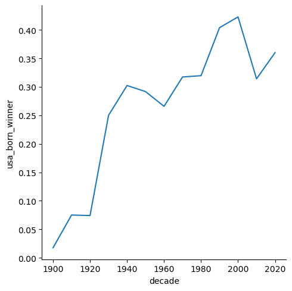
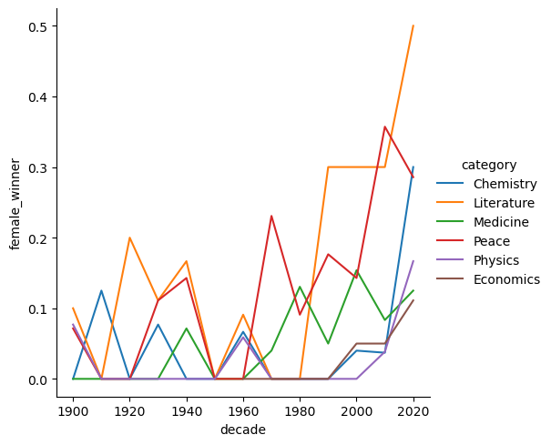

# Visualizing the History of Nobel Prize Winners

The Nobel Prize has been among the most prestigious international awards since 1901. Each year, awards are bestowed in chemistry, literature, physics, physiology or medicine, economics, and peace. In addition to the honor, prestige, and substantial prize money, the recipient also gets a gold medal with an image of Alfred Nobel (1833 - 1896), who established the prize.

<p align="center" width="100%">
    
</p>

The Nobel Foundation has made a dataset available of all prize winners from the outset of the awards from 1901 to 2023. The dataset used in this project is from the Nobel Prize API and is available in the `nobel.csv` file in the `data` folder.

## Insights
### Introduction
The Nobel Prize, a symbol of excellence in various fields, has celebrated outstanding achievements since its inception in 1901. This project delves into the comprehensive dataset provided by the Nobel Foundation, spanning from 1901 to 2023. The visualization and analysis aim to uncover patterns, trends, and notable milestones in the history of Nobel laureates.

### Noteworthy Statistics
The dataset, consisting of 1000 rows and 18 columns, captures essential details about laureates, including gender and birth country. The most common gender among laureates is male, and the United States of America holds the distinction of being the most frequently recorded birth country.

### Proportion of USA-Born Winners Over Time
Analyzing the dataset, the proportion of USA-born winners per decade is computed. The trend reveals an upward trajectory, with the 2000s standing out as the decade with the highest proportion of US-born winners. A visual representation further emphasizes this progression.

### Evolution of Female Laureates
Another significant aspect of the analysis explores the proportion of female laureates per decade and category. The category of Literature in the 2020s emerges with the highest proportion of female laureates. A detailed visual representation illustrates the dynamic shifts in female representation across different categories over the years.

### Pioneering Woman Nobel Laureate
The dataset unveils historical milestones, such as the recognition of the first woman to win a Nobel Prize. Marie Curie, known for her groundbreaking work in Physics, stands as a trailblazer, breaking barriers in the early 20th century.

### Repeat Nobel Laureates
Identifying laureates who have received two or more prizes adds another layer to the analysis. Notable names include Comité international de la Croix Rouge, Linus Carl Pauling, John Bardeen, Frederick Sanger, and the Office of the United Nations High Commissioner for Refugees (UNHCR).

### Conclusion
This exploration of the Nobel Prize dataset provides a rich understanding of the historical landscape of laureates. From the changing demographics of winners to groundbreaking achievements by women and the recognition of repeat laureates, the insights gained contribute to a nuanced appreciation of the Nobel Prize's legacy. The visualizations and analyses presented here offer a glimpse into the diverse and evolving landscape of excellence honored by this prestigious international award.

# Data Analysis
## Loading in required libraries
```python
import pandas as pd
import seaborn as sns 
import numpy as np
```

## Read in the Nobel Prize data
```python
nobel = pd.read_csv('nobel.csv')
nobel
```
Output
```1000 rows x 18 columns```

## Store and display the most commonly awarded gender and birth country in requested variables
```python
top_gender = nobel['sex'].value_counts().index[0]
top_country = nobel['birth_country'].value_counts().index[0]

print("\n The gender with the most nobel laureates is :", top_gender)
print(" The most common birth country of Nobel laureates is :", top_country)
```
Output
```
 The gender with the most nobel laureates is : Male
 The most common birth country of Nobel laureates is : United States of America
```

## Calculate the proportion of USA born winners per decade
```python
nobel['usa_born_winner'] = nobel['birth_country'] == 'United States of America'
nobel['decade'] = (np.floor(nobel['year'] / 10) * 10).astype(int)
prop_usa_winners = nobel.groupby('decade', as_index=False)['usa_born_winner'].mean()
prop_usa_winners
```
Output
| decade | usa_born_winner |
|------|----------|
| 1900 | 0.017544 |
| 1910 | 0.075000 |
| 1920 | 0.074074 |
| 1930 | 0.250000 |
| 1940 | 0.302326 |
| 1950 | 0.291667 |
| 1960 | 0.265823 |
| 1970 | 0.317308 |
| 1980 | 0.319588 |
| 1990 | 0.403846 |
| 2000 | 0.422764 |
| 2010 | 0.314050 |
| 2020 | 0.360000 |

## Identify the decade with the highest proportion of US-born winners
```python
max_decade_usa = prop_usa_winners[prop_usa_winners['usa_born_winner'] == prop_usa_winners['usa_born_winner'].max()]['decade'].values[0]
max_decade_usa
```
Output
```2000```

## Plotting USA born winners
```python
ax1 = sns.relplot(x = 'decade',
                  y = 'usa_born_winner',
                  data = prop_usa_winners, 
                  kind = "line")
```
Output



## Calculating the proportion of female laureates per decade
```python
nobel['female_winner'] = nobel['sex'] == 'Female'
prop_female_winners = nobel.groupby(['decade', 'category'], as_index=False)['female_winner'].mean()
prop_female_winners
```
Output
| decade | category   | female_winner |
|--------|------------|---------------|
| 1900   | Chemistry  | 0.000000      |
| 1900   | Literature | 0.100000      |
| 1900   | Medicine   | 0.000000      |
| 1900   | Peace      | 0.071429      |
| 1900   | Physics    | 0.076923      |
| ...    | ...        | ...           |
| 2020   | Economics  | 0.111111      |
| 2020   | Literature | 0.500000      |
| 2020   | Medicine   | 0.125000      |
| 2020   | Peace      | 0.285714      |
| 2020   | Physics    | 0.166667      |

```72 rows x 3 columns```

## Find the decade and category with the highest proportion of female laureates
```python
max_female_decade_category = prop_female_winners[prop_female_winners['female_winner'] == prop_female_winners['female_winner'].max()][['decade', 'category']]
max_female_decade_category
```
Output
| decade | category |
|--------|----------|
|2020    | Literature|

## Plotting female winners with % winners on the y-axis
```python
ax2 = sns.relplot(x = 'decade', 
                  y = 'female_winner', 
                  hue = 'category', 
                  data = prop_female_winners, 
                  kind = "line")
```
Output



## Finding the first woman to win a Nobel Prize
```python
nobel_women = nobel[nobel['female_winner']]
min_row = nobel_women[nobel_women['year'] == nobel_women['year'].min()]
first_woman_name = min_row['full_name'].values[0]
first_woman_category = min_row['category'].values[0]
print(f"\n The first woman to win a Nobel Prize was {first_woman_name}, in the category of {first_woman_category}.")
```
Output
``` The first woman to win a Nobel Prize was Marie Curie, née Sklodowska, in the category of Physics.```

## Selecting the laureates that have received 2 or more prizes
```python
counts = nobel['full_name'].value_counts()
repeats = counts[counts >= 2].index
repeat_list = list(repeats)

print("\n The repeat winners are :", repeat_list)
```
Ouput
```
 The repeat winners are : Comité international de la Croix Rouge (International Committee of the Red Cross),
Linus Carl Pauling, John Bardeen, Frederick Sanger, Marie Curie, née Sklodowska,
Office of the United Nations High Commissioner for Refugees (UNHCR).
```
